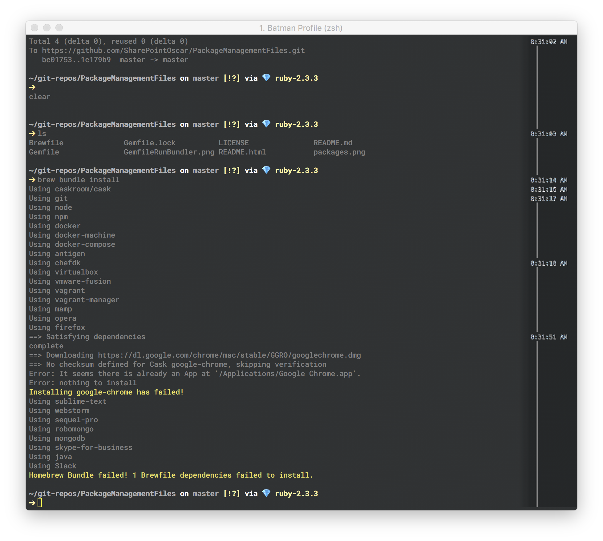
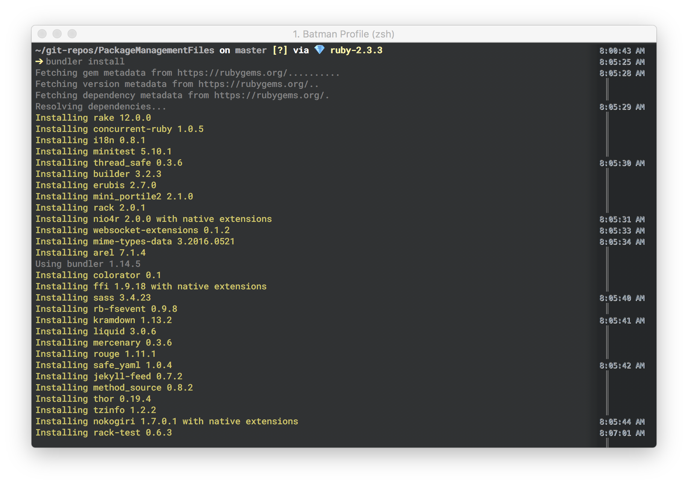

#MY PACKAGE MANAGEMENT FILES  


##Overview
I like to have some control to the chaos of installing different packages and libraries on my Macbook Pro.  These are the files I use to keep things in order.

###BrewFile
I use homebrew to manage various casks and software I need.

Within the directory where the Brewfile resides, run the following command

```shell
brew bundle install
```



###Gemfile
To manage my Gem dependencies I use RVM which is typical.  However, having a Gemfile to replicate my Gems across development machines is a nice thing to have :)

Within the directory where the Gemfile resides, run the following command

```shell
bundler install
```


For more [Bundler info](http://bundler.io/v1.14/guides/using_bundler_in_application.html)

